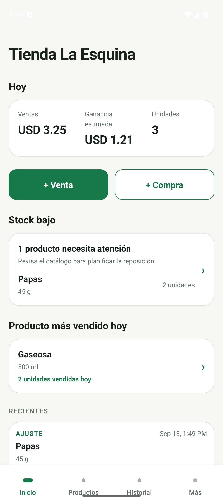
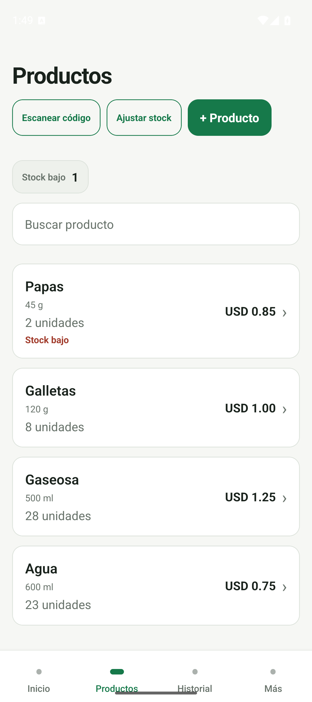
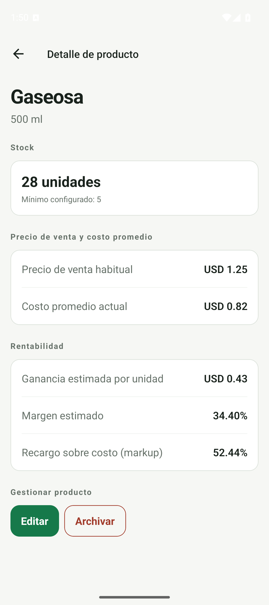
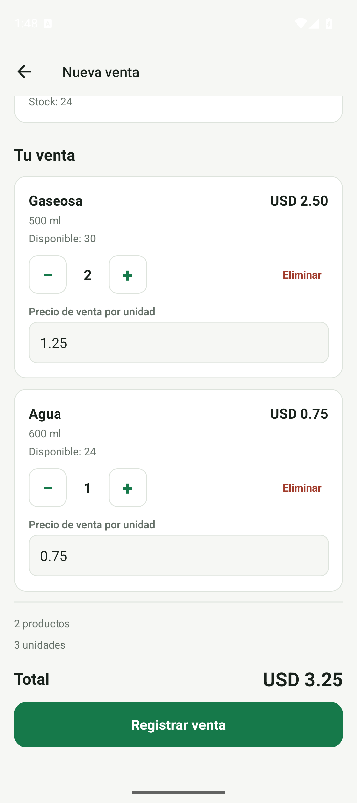
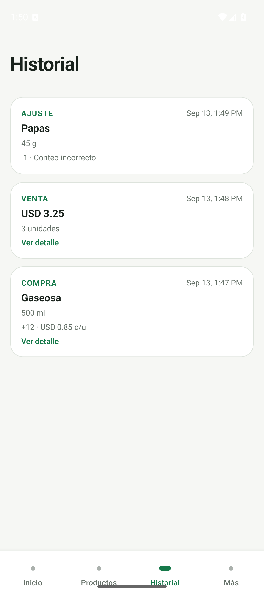

# StockApp — Tu inventario, sin complicaciones

StockApp es una app sencilla para pequeños negocios y emprendedores que compran y venden
productos. Te ayuda a saber qué tienes, qué compraste y qué vendiste, sin llevar todo en Excel
ni aprender un sistema complicado.

## Qué puedes hacer hoy

- Consultar tus productos, cuánto stock queda y cuáles necesitan reposición.
- Registrar compras y ventas, incluyendo varios productos en una misma venta.
- Revisar el historial de compras, ventas y ajustes de inventario.
- Ver el costo promedio, el precio de venta y cuánto ganas aproximadamente por unidad.
- Entender cómo un cambio de costo afecta tu margen y consultar un precio sugerido.
  Tú decides si cambias el precio; la app no lo cambia por su cuenta.

El inventario funciona localmente, incluso sin Internet. La ganancia es una estimación basada
en el precio de venta y el costo del producto: no descuenta alquiler, impuestos ni otros gastos
del negocio. Si no se conoce un costo, la app lo indica en lugar de inventarlo.

StockApp no es un sistema contable ni una caja registradora completa. Está pensada para hacer
más simple el control cotidiano del inventario.

## Estamos en Alpha

Buscamos personas que prueben la app con **datos ficticios** y nos cuenten qué resulta útil,
qué no se entiende y qué falla. Todavía es una versión de prueba: no la uses como único registro
de un negocio real. Los datos se guardan en el dispositivo, sin sincronización entre teléfonos.

La persona que te invite te indicará el canal y los pasos de instalación disponibles para tu
teléfono. Este material no anuncia disponibilidad en Google Play ni TestFlight: preparar esas
distribuciones es un proceso separado.

## Invitación corta

Estamos probando StockApp, una app sencilla para pequeños negocios y emprendedores que quieren
llevar su inventario, compras y ventas sin complicarse con Excel. Buscamos personas que la prueben
un rato con datos de ejemplo y nos cuenten qué les resulta útil, qué no se entiende o qué mejorarían.
¿Te animas a probarla?

## Mensaje rápido

Estoy preparando StockApp, una app sencilla para controlar inventario, compras y ventas.
Te comparto unas capturas reales: ¿te animas a probarla con datos de ejemplo y contarme qué te parece?

## Así luce StockApp

Las imágenes muestran la app real con una tienda y productos ficticios, no diseños ni mockups.
Para una primera invitación, recomendamos compartir **Inicio, Productos y Detalle de producto**.

### 1. Inicio

Un vistazo a las ventas del día, la ganancia estimada, el stock bajo y las operaciones recientes.

### 2. Productos

Productos de una tienda de ejemplo, con existencias, precios y aviso de stock bajo.

### 3. Detalle de producto

Stock, costo promedio y precio de venta, junto con la ganancia y el margen estimados.

### 4. Venta

Una venta con varios productos y sus cantidades, antes de confirmarla.

### 5. Historial

Compras, ventas y ajustes registrados en una misma cronología.

## Para quien comparte este material

- Capturas Android del APK Alpha **0.1.0 (1)**, identidad `com.iankexpo.stockapp`.
- Build EAS: `735f4448-71eb-40a2-a2ea-8e8667b8a5da`; commit fuente `64d0c71`.
- Base documental: `8888d80`; sin diferencias de código de app/paquetes frente al APK.
- Preparación: DOCS-ALPHA-001, 2026-09-13, emulador Android 15 / API 35 separado para esta demo.
- Datos introducidos mediante los formularios reales. Sin seeds, cambios de UI ni acceso directo a SQLite.
- Capturas PNG originales de 1080 × 2424, sin recortes, montajes ni retoques.
- Solo contienen información ficticia; no muestran cuentas, correos ni datos personales.
- No son capturas de iPhone ni una validación de Play Closed Testing o TestFlight.

Consulta [la guía Alpha](../ALPHA_TESTING.md) para instalación, precauciones, checklist de pruebas,
plantilla de feedback y clasificación de problemas. No compartas copias de seguridad con datos
comerciales en reportes públicos.

La [nota de captura](CAPTURE_NOTES.md) registra los datos de ejemplo, la secuencia y los detalles
visuales pendientes, sin modificar la app para ocultarlos.
